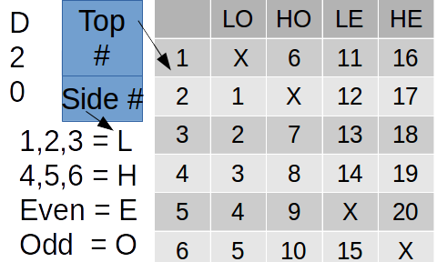

# d24
Rolling a d20 with only one d6 die

Doing some mental gymnastics, I was thinking about emulating regular D&D dice with only d6s.  
But then I thought, 'People have alredy asked this online...  Yep.  But I think I done did find a new method of rolling a D20 with ONLY ONE d6.

## The idea
reading through the ways people posted online on how to emulate dice with other dice I read one little snippet.  'Which side of the dice faces true north'.  
Only one person that I know of thought of this.  

# Use the top of the die (like normal) and use the side of the die that is facing you.  

Print out this 3X5 card.  throw the die, close your eye pick up the die and put it on the square marked 'Top #'  The side that is facing down, will basically be a D4 depending on High, Low, Even, Odd.

While not origional (someone HAS to have thought about this before), I have not found a person that has thought of this.  There are:
* 6 possible outcomes for the top (normal)
* 4 possible outcomes for the side facing you
* a d6 with a d4 on the sides making a D24.

Or to make a 1-6 table: Top number is on the top and side number is on the side.
|  | 1 | 2 | 3 | 4 | 5 | 6 |
| :---: | :---: | :---: | :---: | :---: | :---: | :---: |
| 1 |   | 1 | 2 | 3 | 4 |   |
| 2 | 6 |   | 7 | 8 |   | 10 |
| 3 | X | 12 |   |   | X | 5 |
| 4 | 16 | X |   |   | 9 | X |
| 5 | 11 |   | 13 | 14 |   | 15 |
| 6 |   | 17 | 18 | 19 | 20 |   |
