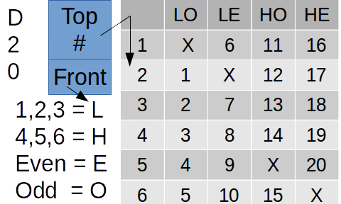

# Rolling a d20 with only one d6 die

Doing some mental gymnastics, I was thinking about emulating regular D&D dice with only d6s.  
But then I thought, 'People have alredy asked this online...  Yep.  But I think I done did find a new method of rolling a D20 with ONLY ONE d6.

## The idea
reading through what people posted online, I read one little snippet.  'Which side of the dice faces true north'.  
Only one person that I know of thought of this.  

Use the top number (normal) and the front of the die!

 Print out this 3X5 card.  roll the die inside your closed hands.  Pick up the die with your thumb and index finger on opposite ends.  
Put the die on the square (marked 'Top #') with your thumb closest to you and your index furthest away.  Your thumb will be be the D4 (side).  
The top number will not have a finger on it and it will be your normal roll.  

# Top and front number

While not origional (someone HAS to have thought about this before), I have not found a person that has thought of this.  There are:
* 6 possible outcomes for the top (normal)
* 4 possible outcomes for the side facing you
* a d6 with a d4 on the front making a D24.
* If you roll a (Top, Front), (1,3), (2,4), (5,3), (6,4), re-roll.

Or to make a 1-6 table: Top number is on the top and side number is on the side.
|  | 1 | 2 | 3 | 4 | 5 | 6 |
| :---: | :---: | :---: | :---: | :---: | :---: | :---: |
| 1 |   | 1 | 2 | 3 | 4 |   |
| 2 | 6 |   | 7 | 8 |   | 10 |
| 3 | X | 12 |   |   | X | 5 |
| 4 | 16 | X |   |   | 9 | X |
| 5 | 11 |   | 13 | 14 |   | 15 |
| 6 |   | 17 | 18 | 19 | 20 |   |

# Back to Mental gymnastics...
24 has divisors of 2, 2, 2, 3.  So with one die we can:
* d2
* d3
* d4 (1=LO, 2=LE, 3=HO, 4=HE)
* d6
* d8 (top number uses HL or EO, your choice)
* d12
* d24

done.
